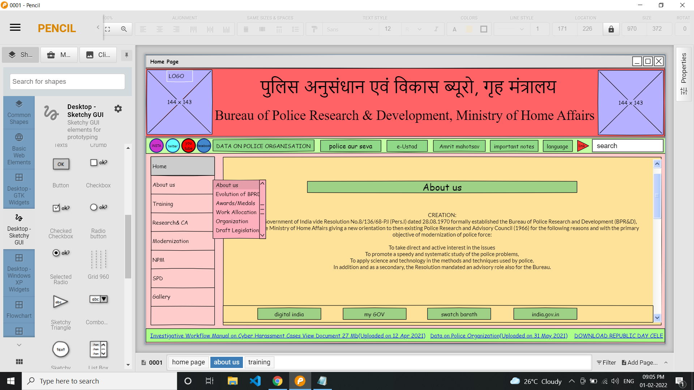

# Wire frame for a website

## AIM:
To design a wire frame for a website.

## DESIGN STEPS:

### Step 1:
The design is done using Pencil project application.

### Step 2:
The pane , group box ,top header ,text feild and many tools are used from the WEB DEVELOPMENTS & DESKTOP-SKETCHY GUI.

## OUTPUT:
include your output screenshots 
### HOME PAGE

### ABOUT US

### TRAINING PAGE

## Result:
Thus a wire frame is designed for a given website.
